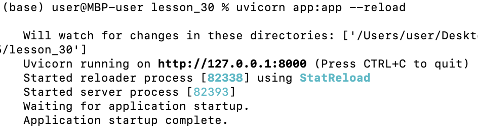
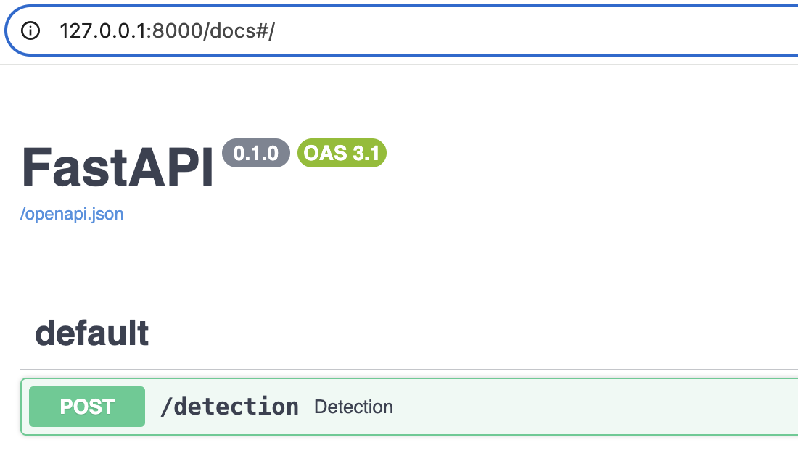
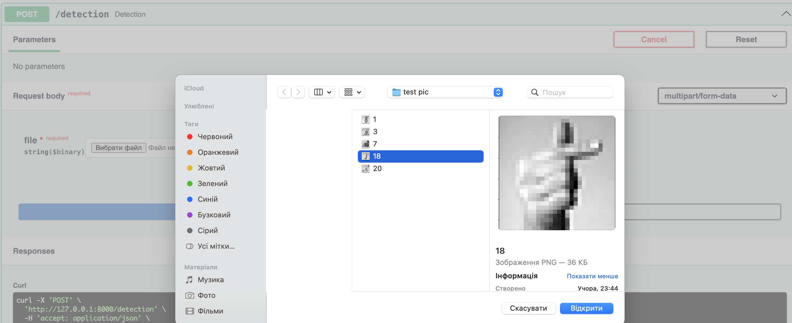
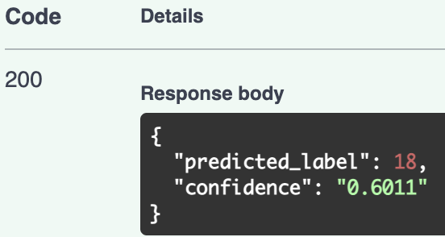

# Homework:API with FastAPI

## Overview
This project implements a **simple computer vision solution** for recognizing **sign language letters** using a neural network trained in PyTorch.  

The idea and dataset were taken from my **Homework #24 (PyTorch)**, where I trained a custom linear NN model on the **Sign Language MNIST dataset**.
In this homework I extended the project by deploying the trained model as a **REST API** using FastAPI.

---

## Installation instruction
```bash
git clone https://github.com/MaksimVelikanich/DataScienceCamp2025.git/lesson_30
cd 
python -m venv venv
pip install -r requirements.txt
```
---

## Deployment Info
```
uvicorn app:app --reload
```
Server will run at:
```
http://127.0.0.1:8000

```
Swagger docs:
```
http://127.0.0.1:8000/docs

```
---

## Modeling info
- Input: 28×28 grayscale images of hand gestures
- Hidden layers: 2×512 neurons with ReLU activation
- Output: 24 classes (letters A–Y without J and Z)

---

## Interface description
**Endpoints**
    *POST*
    - /detection
    *Input:*
    - file: image (PNG/JPG)
    *Output:*
    - {"predicted_label": <integer>, "confidence": <integer>}

---

## Example
1. Start API: uvicorn app:app --reload





2. Open Swagger docs: http://127.0.0.1:8000/docs





3. Upload test image (28×28 hand sign).





4. Example response:


